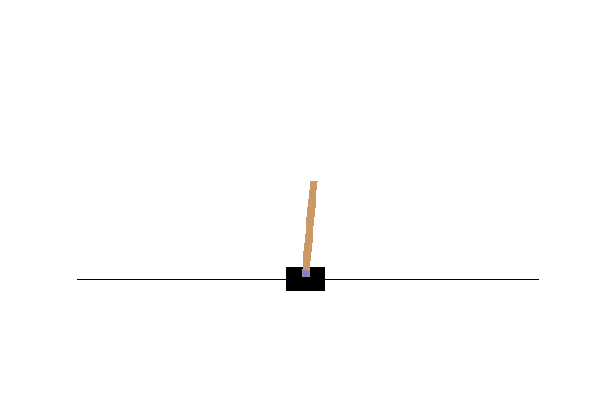
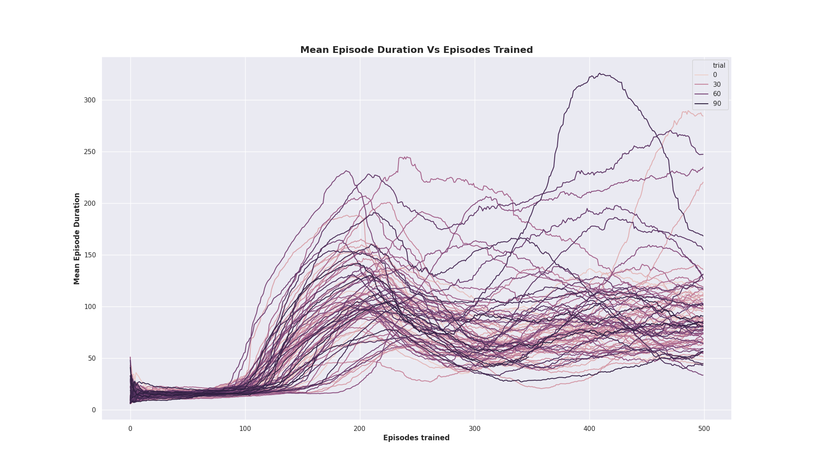

# deepq

## Project Summary

### Introduction

This repository is a results of the final course project for TAU's *Deep Learning Course*.

Our goal was to dive in to the world of RL by implementing DQN and winning an Atari game using raw inputs only (inputs being screen pixels).

The Cartpol game emulated by the OpenAI gym, was chosen as an initial problem given that we could not find any previous implementation that was able to show a Cartpole *win*<sup>1</sup> via DQN **and CNN** using raw input.

We based our code base on the official [pytorch DQN tutorial](https://pytorch.org/tutorials/intermediate/reinforcement_q_learning.html) that itself tries to win Cartpol with DQN+CNN but (from our experience) is not able to win the game under the gym definitions. 

Coming from the world of supervised learning, we were baffled by how **unstable** and **inconsistent** the training process for a DQN agent can be and how they prevent the agent from winning the game.

One must note that most, if not all, of the succesful DQN Cartpole solutions circulating online solve the problem using a 4 dimensional state as input (), making this a **much** simpler problem than reading raw pixels.   

Most of our effort  was centered around improving stability and consistency. We experimented with architectural changes to the policy network, an extensive hyperparameter search and learning rate scheduling methods. These only resulted in a minor improvement to stability and consistency.

Eventually, we were able to bypass stability issues and win the game using a learning rate regime in which the scheduler was score-aware and could reduce the learning rate drastically when performance was good enough to win the game.

<sup>1</sup>From https://gym.openai.com/envs/CartPole-v0/: "*CartPole-v0 defines "solving" as getting average reward of 195.0 over 100 consecutive trials.*"

### Results

#### The good new

> The agent was (sometimes) able to win the game 
>
> The agent (consistently) learned to play much better than random

Below is one game played by one o56f our trained agents, it is clear that the agent learned the rules and was able to play the game well. 




#### The bad news

> The agent was not able to learn to win the game consistently

Below is an analysis of 90 training sessions with identical parameters of our final configuration. Each curve represents the running average of the last 100 episode durations during training. 

This figure shows that:

1. The agent consistently learns to play the game better than random.

2. The learning process is extremely unstable, "forgetting" episodes are frequent.

3. In some sessions, the agent learned to win the game (all lines passing the 200 mean episode durations line)

   



### Conclusions

We found RL much harder to implement and experiment with than supervised, semi-supervised and even unsupervised learning. It is very sensitive to hyperparameters and even random seeds.

In our view, the presentation of DQN as a silver bullet solution in the original paper is inaccurate. Our experience along with results from many other solutions circulating online concludes that DQN, altough able to learn the cartpol game from raw inputs, is unable to master it due to its unstability and inconsistentency. 

## Prerequisites

- Linux or macOS
- Python 3
- CPU or NVIDIA GPU + CUDA CuDNN 10

## Getting Started
### Installation

- Clone this repository:

```bash
git clone https://github.com/pytorch-rl/mspacman.git
```

- Add repository path to your PYTHONPATH:

```bash
cd deepq
export PYTHONPATH=$PWD:PYTHONPATH
```

- Install requirements:

```bash
pip install -r requirements.txt`
```

### Training

- We assume that the pwd is ``deepq``. We will use a ``results`` directory in 
the repository for the follweing examples.

- The training code performs online validation. So first, we need to create
a validation set using:

```bash
python validation/validation_set_generator.py
```

Note that you can disabel validation using:

```python
 Q_VALIDATION_FREQUENCY: -1
 SCORE_VALIDATION_FREQUENCY: -1
```

- Now you are ready to train your agent:

```bash
python train/train.py --cfg_path="./config/best_train_cfg.yaml"
```

#### Hyperparameters

#### Tips

### Apply a pretrained model

Run `run_pretrained.py`:
```bash
python run_pretrained.py
```

With the possibility of defining your own trained checkpoint `--ckpt_path` and disabling gif saving via entering 'False' in  `--save_gif`. Note that gif saving is dependent on having Imagemagick installed (sudo apt install imagemagick).

By default, the agent is loading a predefined model `assets/checkpoint.pt` and saves the `.gif` file to `results/cartpole_example.gif`.


## Citation

The algorithm used in this project is based on:

```
Mnih, V., Kavukcuoglu, K., Silver, D., Graves, A., Antonoglou, I., Wierstra, D. and Riedmiller, M., 2013. Playing atari with deep reinforcement learning. arXiv preprint arXiv:1312.5602.
```

## Acknowledgments

Our code is based on the [official pytorch DQN tutorial](https://github.com/pytorch/tutorials/blob/master/intermediate_source/reinforcement_q_learning.py).  
